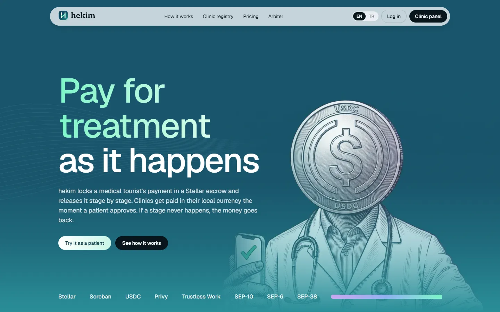
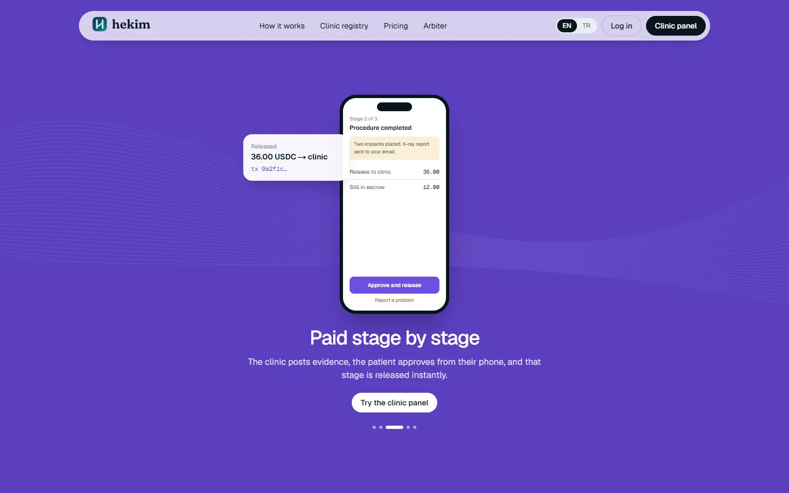
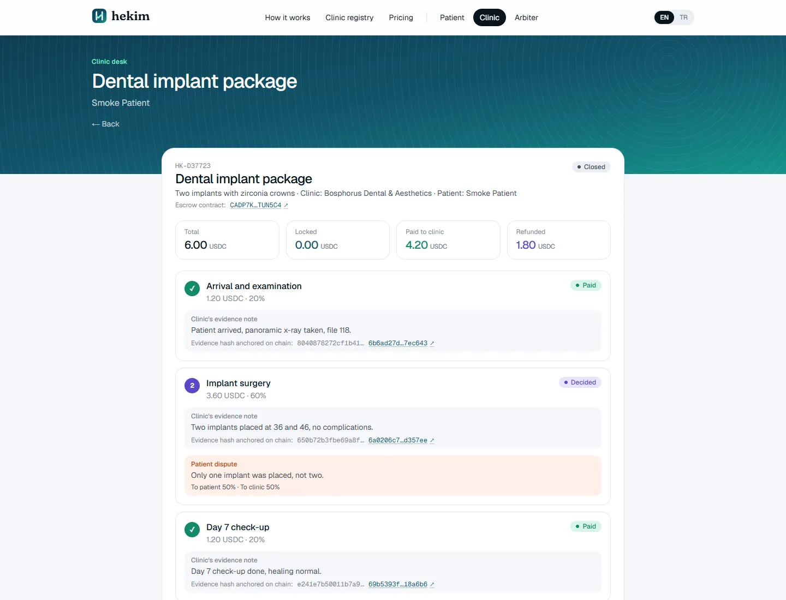
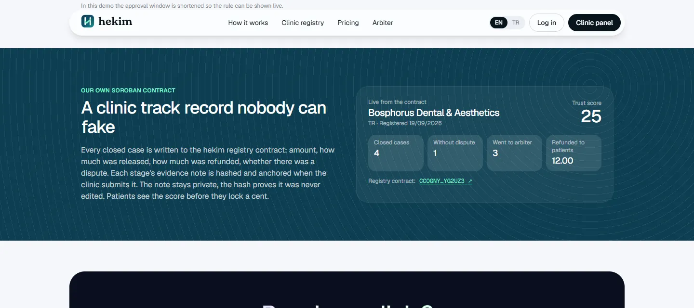
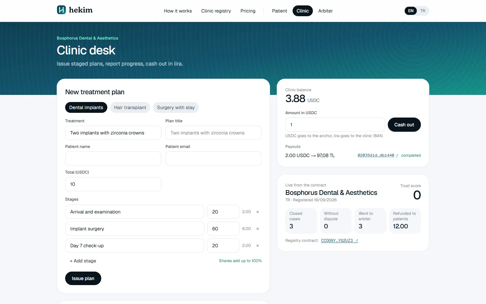
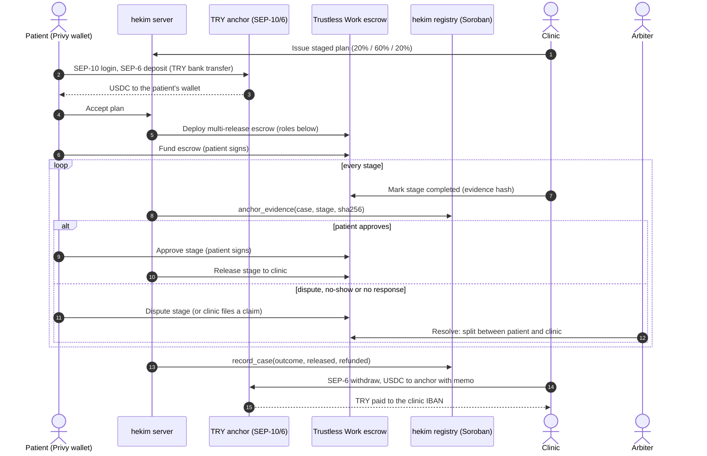
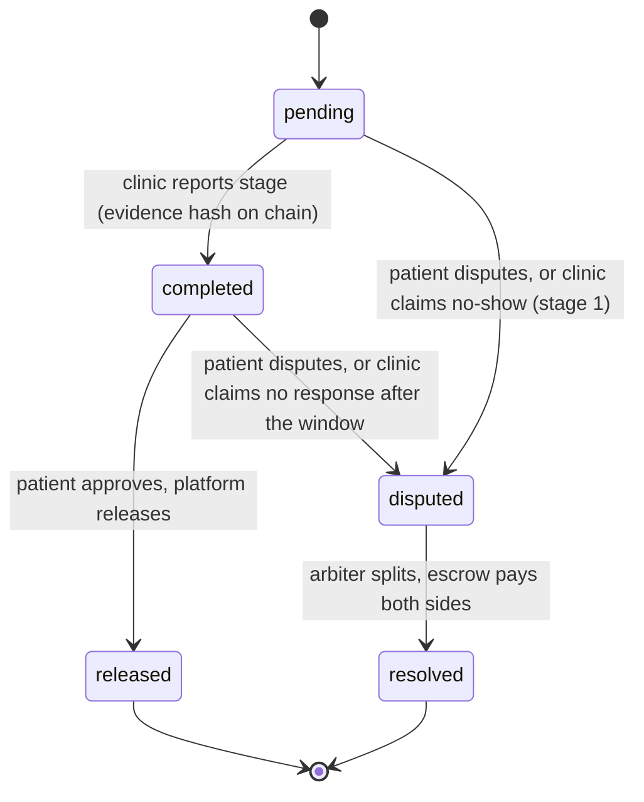
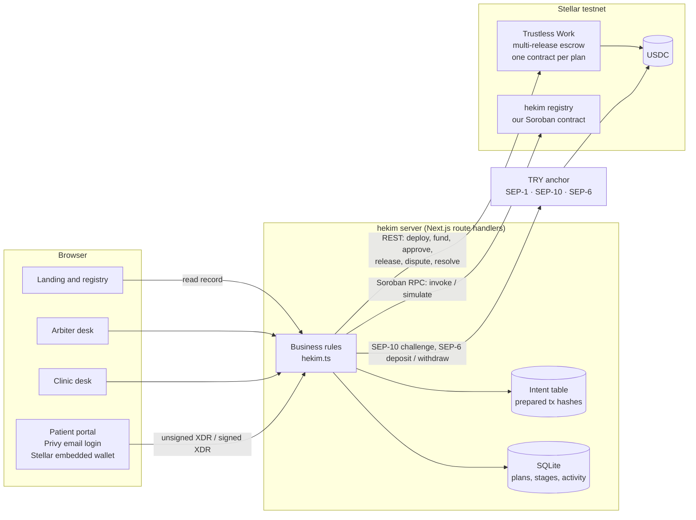

<p align="center">
  
</p>

<h1 align="center">hekim</h1>

<p align="center">
  <b>Staged payments for medical travel, on Stellar.</b><br/>
  The patient's money is released stage by stage, only as treatment actually happens.
</p>

<p align="center">
  
  
  
  
  
  
  
</p>

<p align="center">
  <a href="#the-problem">Problem</a> ·
  <a href="#how-it-works">How it works</a> ·
  <a href="#architecture">Architecture</a> ·
  <a href="#on-chain-proof">On-chain proof</a> ·
  <a href="#the-registry-contract">Registry contract</a> ·
  <a href="#run-it-locally">Run it</a> ·
  <a href="#türkçe-özet">Türkçe</a>
</p>

---

Built at the **Rise In x Stellar Pro Hackathon**, Istanbul, 19-20 September 2026 (Genesis track).

## The problem

About **21-22 million people** travel abroad for medical care every year ([Medical Tourism Watch](https://medicaltourismwatch.com/global-medical-tourism-statistics/)). Türkiye alone received **1,398,580 health tourists in 2025** and earned **3.02 billion USD** from them ([USHAŞ data via Turizm Ajansı](https://www.turizmajansi.com/amp/saglik-turizmi-geliri-3-milyar-dolari-asti-h71492)).

The patient and the clinic have never met and live under different laws.

| | Today |
|---|---|
| **Patient** | Pays up front or wires a deposit to a foreign account. If the price changes at the desk, a service is skipped or the treatment never happens, the only remedy is a lawsuit in another country. |
| **Clinic** | Card chargebacks months later, patients who never arrive after the transfer and hotel were booked, slow and expensive cross-border collection. |

hekim solves one problem: **trust in the payment between a foreign patient and a clinic.** It is not a marketplace and never sets prices.

## The solution

<table>
<tr>
<td width="50%"></td>
<td width="50%"></td>
</tr>
<tr>
<td>The patient approves each stage from their phone and that slice is released instantly.</td>
<td>A real closed case: every stage, evidence hash, dispute and release links to its Stellar transaction.</td>
</tr>
<tr>
<td width="50%"></td>
<td width="50%"></td>
</tr>
<tr>
<td>The clinic's track record, read live from our Soroban contract.</td>
<td>The clinic desk: staged plan templates, lira cash-out, registry record.</td>
</tr>
</table>

- **Patients sign in with email.** Privy creates a Stellar wallet in the background. No seed phrase, no extension.
- **The money is locked, not sent.** Every plan gets its own multi-release Soroban escrow. Nobody can move the money alone.
- **Paid stage by stage.** The clinic posts evidence, the patient approves, that stage is released.
- **Lira in, lira out.** Patients top up by bank transfer through a SEP-6 anchor (or send USDC they already hold). Clinics cash out to their IBAN in TRY and never touch crypto.
- **Problems go to an arbiter.** The money stays locked; an independent arbiter refunds, pays or splits, and the contract enforces it.
- **A track record nobody can fake.** Every closed case and every evidence hash is written to our own Soroban registry contract.

### Rules that protect both sides

| Rule | What happens |
|---|---|
| **Approval window** | After the clinic reports a stage the patient has 72 hours (2 minutes in the demo) to approve or dispute. If they stay silent the clinic can ask the arbiter. Money never moves automatically. |
| **No-show** | If the patient locks the money and never arrives, the clinic files a no-show claim on the first stage. Suggested decision: half for the clinic's costs, the rest of the plan refunded. |
| **Nobody moves money alone** | Every release needs the patient's signature or an arbiter decision. Not the clinic, not the patient, not hekim. |

## How it works



### Stage lifecycle



### Roles in every escrow

| Trustless Work role | Account | Why |
|---|---|---|
| `approver` | Patient (Privy wallet) | Only the patient can approve a stage |
| `serviceProvider` | Clinic | Reports stages; can raise no-show and no-response claims |
| milestone `receiver` | Clinic | Receives released stages |
| `releaseSigner` | hekim platform | Releases right after the patient's approval, so the clinic cannot pull money |
| `disputeResolver` | Arbiter | The only account that can split a disputed stage |
| `platformAddress` | hekim platform | Receives the 1% platform fee |

## Architecture



### How a patient signature is protected

1. The server asks Trustless Work for the unsigned transaction and stores its hash as an **intent** (case, action, stage).
2. The browser signs the transaction hash with Privy's `signRawHash` on the Stellar curve. The private key never reaches hekim. The client refuses anything that is not for the testnet passphrase.
3. The server submits the signed XDR **only if its hash matches a stored intent** for that case and action. Nobody can make the server mark a stage approved with some other signed transaction.

The same pattern signs the USDC trustline (the server accepts only a single `changeTrust` for USDC from the patient's own account) and the SEP-10 challenge (validated with `WebAuth.readChallengeTx` against the anchor's `SIGNING_KEY` before any server key signs it).

## On-chain proof

Everything below ran on Stellar testnet on 19 September 2026 during the hackathon. Click any hash to see it on Stellar Expert.

### Case HK-D37723: happy path with one dispute

Escrow contract [`CADP7K…UN5C4`](https://stellar.expert/explorer/testnet/contract/CADP7KTTAWWEND7QXNOYGBQ3ZWORXRFWOPQ2LYZF4GYQ2NUU4ATUN5C4)

| Step | Signed by | Transaction |
|---|---|---|
| Escrow deployed for the plan | platform | [`9e63c45b…`](https://stellar.expert/explorer/testnet/tx/9e63c45b593a318479c8b1e830bf7b40b6e1a4af5e6f078f3713f0198c832e18) |
| 6 USDC locked | patient | [`2e356458…`](https://stellar.expert/explorer/testnet/tx/2e35645817138459e1f90847b65229fc343907dfe34635fafa5b0e614dab3c80) |
| Stage 1 reported with evidence hash | clinic | [`85677bea…`](https://stellar.expert/explorer/testnet/tx/85677bea30aec76e3cf6f7e2074945d5f46da063426a15cb9be9180aa47740d4) |
| Evidence hash anchored in registry | platform | [`6b6ad27d…`](https://stellar.expert/explorer/testnet/tx/6b6ad27dbdc554edd3fbb391549889a5edbdae32cec9cedc38a643c0b17ec643) |
| Stage 1 approved | patient | [`b806150c…`](https://stellar.expert/explorer/testnet/tx/b806150cedf203dea255e580fcb9c8bf3ef4dd69a4b5164e78a9ee2c7f4e1a1c) |
| Stage 1 released to clinic | platform | [`0522e93d…`](https://stellar.expert/explorer/testnet/tx/0522e93db10c2423b7322eba890577f0182e5f27172ac7de252c2ae4efb4979c) |
| Stage 2 disputed by the patient | patient | [`60729e71…`](https://stellar.expert/explorer/testnet/tx/60729e71f9c03580439be78a713aa9ab05399022c52bb1e10d53481549a617dc) |
| Arbiter splits stage 2 50/50 | arbiter | [`183187d0…`](https://stellar.expert/explorer/testnet/tx/183187d07626b9bedad90a224f78f3104b15a6d4655bfae074a495df510e8800) |
| Stage 3 released | platform | [`7af09e3a…`](https://stellar.expert/explorer/testnet/tx/7af09e3adf648669cb3259fc9f79fc26f71f02ef9be543d70c5a012279ab7ed1) |
| Outcome recorded in the clinic registry | platform | [`6efbad7c…`](https://stellar.expert/explorer/testnet/tx/6efbad7c3870dce87dd2e6ee3f03fcba7b8ab9edad872a957266fe162ec452bf) |

### Case HK-980B17: patient never arrived

Escrow contract [`CDYQDS…OIUZI`](https://stellar.expert/explorer/testnet/contract/CDYQDSEQPZDCA6SPT2ZGWPIVEC6RHLQU5Q6ZZQCVQDWLNSHNVPSOIUZI)

| Step | Signed by | Transaction |
|---|---|---|
| Clinic files a no-show claim on stage 1 | clinic | [`54a3df4c…`](https://stellar.expert/explorer/testnet/tx/54a3df4caf126602eecf26e76230c9acaf4370a67dbb83d56064f2a6844f8da7) |
| Arbiter splits stage 1 for the clinic's costs | arbiter | [`0c459147…`](https://stellar.expert/explorer/testnet/tx/0c459147d1e13612097bfc09e027298d9cefd4b26f7434e614c71c64e8b4a785) |
| Stage 2 refunded to the patient | arbiter | [`e00ce5a1…`](https://stellar.expert/explorer/testnet/tx/e00ce5a1d64a351189b4e61cc97a51b04308affe43e553588a7cbb6141d188c4) |
| Stage 3 refunded to the patient | arbiter | [`60cc41d1…`](https://stellar.expert/explorer/testnet/tx/60cc41d1f6f2927cfa4477a30c4411522246c2ac5b8b9a38c9ab3934b152b390) |
| Outcome recorded in the clinic registry | platform | [`9af9cb90…`](https://stellar.expert/explorer/testnet/tx/9af9cb909f64997d3dceafceeb48634bc92b34ae8758b3e0139ed48b37e08437) |

### Case HK-9CE4EA: patient went silent

A claim before the 2-minute window ended was rejected by the server. After the window the clinic's claim went through.

| Step | Signed by | Transaction |
|---|---|---|
| Clinic claims "no response" after the window | clinic | [`4811e6e9…`](https://stellar.expert/explorer/testnet/tx/4811e6e978d1457d9a80ae1eb35ee888412cc230b2e5beeebace9c1cdde31106) |
| Arbiter pays the reported stage to the clinic | arbiter | [`7bbff811…`](https://stellar.expert/explorer/testnet/tx/7bbff811f18c8b58b79e77de49f376e69f7b4b90b8bc3f83789423d4298319c3) |
| Outcome recorded in the clinic registry | platform | [`29abe23e…`](https://stellar.expert/explorer/testnet/tx/29abe23ea97466ba7d9dee2354555b25a311fe7e91d42213a14d2fea5075c9a2) |

### Lira in, lira out

| Flow | Result | Transaction |
|---|---|---|
| Patient top-up, SEP-6 deposit | 400 TRY became 8.159 USDC | anchor payment to the patient wallet |
| Clinic cash-out, SEP-6 withdraw | 2 USDC became **97.08 TRY** at the clinic IBAN | [`02035d1d…`](https://stellar.expert/explorer/testnet/tx/02035d1da680b15fecff8f8c27e3cc025d2d6ddd3dcfa3588dcc9375c3db1440) |

### Accounts and contracts

| What | Address |
|---|---|
| hekim registry contract | [`CCOGNY4Q3APUUPZ4BNLQBDZE5FHHJNW2DJARQLWVJMWBMHPXTMYG2UZ3`](https://stellar.expert/explorer/testnet/contract/CCOGNY4Q3APUUPZ4BNLQBDZE5FHHJNW2DJARQLWVJMWBMHPXTMYG2UZ3) |
| Platform (escrow deployer, release signer, registry admin) | [`GD5TPM…JQKX`](https://stellar.expert/explorer/testnet/account/GD5TPMRD34YEVCFWH2ABODY27KWRWXEB47RJOHPSQL4CLEY2PAW2JQKX) |
| Demo clinic | [`GDKYI7…WZ23`](https://stellar.expert/explorer/testnet/account/GDKYI7R5JCOFDZZVUAJQLG5OFBQUZMKSLOPYUVVJICQCNMIA6AW7WZ23) |
| Demo arbiter | [`GC4XQ2…NNHU`](https://stellar.expert/explorer/testnet/account/GC4XQ2M7AEVDE4LO6X526GJN3DL57I37AQL3POXCRT7N2ITW3UZ3NNHU) |
| USDC (Circle testnet, also the anchor's asset) | `GBBD47IF6LWK7P7MDEVSCWR7DPUWV3NY3DTQEVFL4NAT4AQH3ZLLFLA5` |

## The registry contract

`contracts/registry` is our own Soroban contract (Rust, `soroban-sdk` 28). The escrow proves one case was fair. The registry answers what a new patient actually needs to know: **how has this clinic behaved with previous patients?**

| Function | Auth | Purpose |
|---|---|---|
| `__constructor(admin)` | deployer | Stores the platform as admin |
| `register_clinic(clinic, name, country)` | admin | Opens a clinic record |
| `anchor_evidence(case_id, stage, hash)` | admin | Stores the SHA-256 of a stage's evidence note once. The note itself never goes on chain |
| `record_case(case_id, clinic, amount, released, refunded, disputes, evidence_root)` | admin | Writes a closed case once, updates the clinic's counters, returns `Completed`, `Arbitrated` or `Refunded` |
| `clinic`, `case`, `evidence` | none | Public reads |
| `trust_score(clinic)` | none | Share of closed cases without any dispute, in basis points |

Persistent storage with TTL extension on every write, checked arithmetic, typed errors, `#[contractevent]` events (`ClinicRegistered`, `EvidenceAnchored`, `CaseRecorded`) and 7 unit tests, including the auth tree and the event topics. Full reference: [contracts/registry/README.md](contracts/registry/README.md).

## Hackathon requirements

| Requirement | How hekim meets it |
|---|---|
| **Integration partner** | **Privy** (eligible wallet partner): email login and a Stellar embedded wallet. The patient signs the trustline, the SEP-10 challenge and every fund, approve and dispute transaction with it. **Trustless Work**: multi-release escrow on Soroban. |
| **Anchor / local payments** | TRY anchor (`tr-mock-anchor.fly.dev`): SEP-1 discovery, SEP-10 auth, SEP-6 deposit for patients and SEP-6 withdraw for clinics. Real TRY in, real TRY out, simulated only on the bank side of the sandbox. |
| **Core feature** | The escrow and the anchor are the product: lock, release by stage, dispute, cash out. |
| **Own contract** | `contracts/registry`, deployed and used by every closed case. |

## Security and privacy

- **No medical data on chain.** Escrow titles are generic (`hekim HK-XXXX`), stage names are `Stage 1..n`, and stage evidence is stored on chain only as `sha256:<hash>`. Diagnosis and treatment details stay off chain (KVKK, GDPR).
- **Signatures match intents.** The server only submits a patient-signed transaction whose hash it prepared for that case and action.
- **SEP-10 challenges are validated** before any server-held key signs them, and anchor tokens are bound to the JWT subject.
- **Money math in integers.** Amounts are handled in stroops (`bigint`, 7 decimals). Dispute splits are computed on the amount after the 1% platform and 0.3% protocol fees, so distributions always match what the escrow holds.
- **Secrets stay local.** Keys live in `.env.local`, which is git-ignored.

## Business model

| | Fee |
|---|---|
| hekim, taken inside the escrow on each released stage | **1%** |
| Trustless Work protocol | 0.3% |
| Typical international card or wire cost for the clinic today | 3-5% plus chargeback risk |

On a 3,000 USD plan hekim earns 30 USD, the protocol 9 USD, and the clinic receives the local-currency equivalent of 2,961 USD. The patient pays nothing above the agreed price. Distribution goes through health-tourism facilitators: one facilitator brings many clinics.

## Global by design

Patients are already global: anyone signs in with email and pays in digital dollars. Clinics join corridor by corridor. The anchor client speaks standard SEP-1/10/6, so adding Mexico (MXN), Thailand (THB), Colombia (COP) or Korea (KRW) is a new anchor home domain in configuration, not new code. Türkiye is the first corridor because the event provides a TRY anchor.

## Run it locally

Requirements: **Node 22.13+** (the app uses the built-in `node:sqlite`), a [Trustless Work](https://dapp.trustlesswork.com) testnet API key and a [Privy](https://dashboard.privy.io) app with email login. For the contract: Rust with the `wasm32v1-none` target and the [Stellar CLI](https://developers.stellar.org/docs/tools/cli).

```bash
npm install
cp .env.example .env.local
npm run setup

cd contracts
cargo test
stellar contract build
stellar contract deploy --wasm target/wasm32v1-none/release/hekim_registry.wasm   --source-account <PLATFORM_SECRET> --network testnet -- --admin <PLATFORM_ADDRESS>
cd ..

npm run setup
npm run dev
```

1. The first `npm run setup` creates the platform, clinic and arbiter keys in `.env.local`, funds them with Friendbot, opens USDC trustlines and prints the exact deploy command with your platform address.
2. Put the deployed contract id in `REGISTRY_CONTRACT_ID`, and add `TW_API_KEY` and `NEXT_PUBLIC_PRIVY_APP_ID` to `.env.local`.
3. The second `npm run setup` registers the demo clinic in the registry.
4. Open http://localhost:3000.

Without `NEXT_PUBLIC_PRIVY_APP_ID` the landing, clinic and arbiter pages work and the patient page explains what is missing. Without `TW_API_KEY` everything works up to accepting a plan.

### Check that it works

```bash
npm run typecheck
npm run lint
cd contracts && cargo test && cd ..
npm run e2e
```

`npm run e2e` drives the whole product against Stellar testnet through the app's own API, with a local key playing the patient instead of Privy: wallet activation and USDC trustline, SEP-10 login, a 400 TRY SEP-6 top-up, a plan with escrow deployment and funding, stage reports with evidence hashes, approvals and releases, a patient dispute and an arbiter split, case closing and the registry record. Other scenarios: `npm run e2e -- noshow`, `npm run e2e -- noresponse` (waits for the 2-minute window), `npm run e2e -- payout` (clinic cash-out to TRY). It needs the dev server running.

| Page | What you can do |
|---|---|
| `/` | Product story, live registry, "try it as a patient" |
| `/patient` | Email login, wallet, lira top-up, accept, lock, approve, dispute |
| `/clinic` | Issue plans from templates, report stages, claims, lira cash-out |
| `/arbiter` | Resolve disputes with a suggested split |

Every screen is available in English and Turkish.

### Demo script (5 minutes)

1. On `/`, enter your email under **Try it as a patient**. A 6 USDC dental plan is issued to you.
2. On `/patient`, sign in with that email, create and activate the wallet, connect to the lira anchor, top up 300 TL and press **I have made the transfer**.
3. Open the plan, **accept** it (escrow deployed) and **lock 6 USDC**.
4. On `/clinic`, mark stage 1 done with a note. The evidence hash appears with its transaction.
5. As the patient, **approve** stage 1. It is paid to the clinic.
6. Mark stage 2 done, press **Report a problem** as the patient, split it on `/arbiter`.
7. Finish stage 3. The case closes and the clinic's registry record changes on the home page.
8. On `/clinic`, cash out 1 USDC to lira.

## Project structure

```
contracts/registry/        Soroban registry contract and tests
scripts/setup.mjs          Creates and funds demo accounts, registers the clinic
scripts/e2e.mjs            End-to-end run of every flow on testnet
src/lib/server/
  hekim.ts                 Cases, stages, approval window, claims, arbiter, registry hooks
  trustless.ts             Trustless Work REST client
  anchor.ts                SEP-1, SEP-10, SEP-6 client with challenge validation
  registry.ts              Soroban RPC client for the registry
  stellar.ts               Horizon helpers, trustlines, payments
  db.ts                    node:sqlite store
src/app/api/               Route handlers
src/components/            Landing, patient, clinic and arbiter UI
docs/technical.md          Components, design decisions and trade-offs
```

## Design decisions

The short version, the full table is in [docs/technical.md](docs/technical.md):

- **Trustless Work for escrow, our own contract for reputation.** We did not rewrite an audited escrow. Our Soroban code focuses on what medical travel needs and the escrow cannot give: a public, tamper-proof track record.
- **Deadlines in app logic, enforcement on chain.** Trustless Work has no timers, so an expired approval window opens a clinic-signed dispute and only the arbiter moves money.
- **Server-held keys for clinic, arbiter and platform** in the demo; per-clinic wallets and a multisig arbiter panel in production.
- **SQLite** for zero-setup judging; escrow state itself always lives on chain.

## Stellar skills used

We used these skill files while building and then audited the code against them:

| Skill file | What we took from it |
|---|---|
| [skills.stellar.org/skills/smart-contracts/SKILL.md](https://skills.stellar.org/skills/smart-contracts/SKILL.md) | Contract layout with `__constructor`, `#[contractevent]`, release profile with `overflow-checks` |
| [skills.stellar.org/skills/smart-contracts/development.md](https://skills.stellar.org/skills/smart-contracts/development.md) | Instance vs persistent storage, TTL extension on every write, event topics, no personal data on chain |
| [skills.stellar.org/skills/smart-contracts/security.md](https://skills.stellar.org/skills/smart-contracts/security.md) | Auth from the stored admin, checked arithmetic, client-side network check before signing |
| [skills.stellar.org/skills/dapp/SKILL.md](https://skills.stellar.org/skills/dapp/SKILL.md) | `prepareTransaction` before signing, `pollTransaction`, handling `TRY_AGAIN_LATER` |
| [CheesecakeLabs/stellar-anchor-skill](https://raw.githubusercontent.com/CheesecakeLabs/stellar-anchor-skill/main/SKILL.md) | Validate the SEP-10 challenge before signing, bind the JWT subject to the account, re-authenticate on 401, withdraw memo types |
| [Trustless-Work/trustlesswork-skill](https://raw.githubusercontent.com/Trustless-Work/trustlesswork-skill/main/trustless-work-dev/SKILL.md) | Multi-release payloads, role separation, dispute distributions |

## Scope notes

- Testnet only. The anchor is the event's sandbox TRY anchor (50 to 3,000 TRY per deposit); the bank leg is simulated.
- Clinic and arbiter are single demo accounts without login.
- Yield on locked funds would be credited to the patient on mainnet; testnet assets earn nothing and the UI says so.
- Brand illustrations were prepared before the event. All code, contracts, accounts and on-chain transactions were created during the hackathon.

---

## Türkçe özet

**hekim, sağlık turizmi için Stellar üzerinde aşamalı ödeme güvencesidir.** Yurt dışından tedaviye gelen hasta, anlaşılan fiyatı Soroban emanetine kilitler. Para, hasta her aşamayı onayladıkça kliniğe geçer. Klinik SEP-6 anchor'ı üzerinden lira olarak çeker. Sorun çıkarsa para kilitli kalır, bağımsız hakem karar verir. Kapanan her vaka, sahtesi yapılamayan zincir üstü klinik siciline yazılır.

- **Entegrasyon:** Privy (e-postayla giriş, seed ifadesi olmadan Stellar cüzdanı) ve Trustless Work (çok aşamalı emanet).
- **Anchor:** TRY anchor'ı ile SEP-10 girişi, SEP-6 yatırma (hasta) ve SEP-6 çekme (klinik).
- **Kendi kontratımız:** `contracts/registry`. Klinik sicili, kanıt hash'leri ve güven puanı tutar.
- **Adil kurallar:** 72 saat onay süresi (demoda 2 dakika), gelmeme kuralı. Parayı kimse tek başına hareket ettiremez.
- **İş modeli:** Serbest bırakılan her aşamadan %1 hekim ücreti ve %0,3 protokol ücreti. Hasta anlaşılan fiyatın üstüne bir şey ödemez.
- **Zincir kanıtı:** Mutlu yol, itiraz, gelmeme, onay gelmedi ve lira çekimi testnet'te çalıştı. Tüm işlemler yukarıdaki tablolarda.
- **Arayüz:** Tüm ekranlar İngilizce ve Türkçe.
