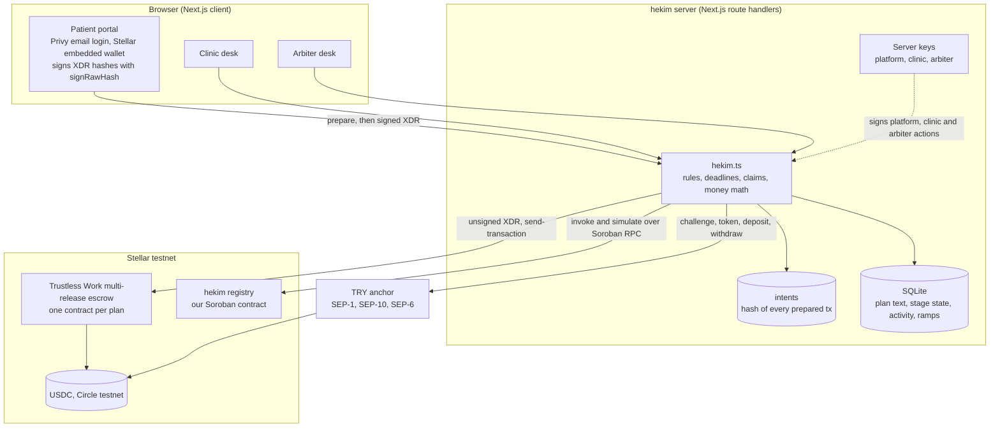

# hekim technical document

1. [Architecture](#1-architecture)
2. [Components and responsibilities](#2-components-and-responsibilities)
3. [Contracts and addresses](#3-contracts-and-addresses)
4. [Design decisions and trade-offs](#4-design-decisions-and-trade-offs)
5. [Technical problems we hit](#5-technical-problems-we-hit)
6. [Tests](#6-tests)
7. [Security and privacy](#7-security-and-privacy)
8. [Failure modes](#8-failure-modes)
9. [Scope limits](#9-scope-limits)

## 1. Architecture

Where the truth lives:

| Data | Source of truth |
|---|---|
| Money, stage flags (approved, released, disputed, resolved) | Trustless Work escrow contract on chain |
| Clinic track record, evidence hashes | hekim registry contract on chain |
| Balances, trustlines, payments | Stellar ledger (Horizon) |
| Anchor transfers | Anchor, SEP-6 `/transaction` |
| Plan text, patient name and email, evidence notes, activity log, approval deadlines | SQLite on the hekim server |

## 2. Components and responsibilities

| Path | Responsibility |
|---|---|
| `src/lib/server/hekim.ts` | Plan creation, registry gate, escrow deployment, patient intents, stage completion, approval window, no-show and no-response claims, arbiter split, refund of remaining stages, registry writes, anchor ramps |
| `src/lib/server/trustless.ts` | Trustless Work REST client. Every write returns an unsigned XDR; the role holder signs it and `/helper/send-transaction` submits it |
| `src/lib/server/anchor.ts` | SEP-1 signing key discovery, SEP-10 challenge validation (`WebAuth.readChallengeTx`) and token exchange bound to the JWT subject, SEP-6 deposit, withdraw and status, re-authentication on 401 |
| `src/lib/server/registry.ts` | Soroban RPC: `prepareTransaction`, `sendTransaction` with `TRY_AGAIN_LATER` retry, `pollTransaction`; read-only calls through simulation |
| `src/lib/server/stellar.ts` | Horizon: Friendbot, balances, USDC trustline builder and validator, payments with memo |
| `src/lib/server/db.ts` | `node:sqlite` store with a small column migration |
| `src/app/api/*` | Route handlers: `cases`, `cases/[id]`, `demo`, `disputes`, `wallet/[address]`, `anchor`, `clinic`, `config` |
| `src/components/patient/wallet.tsx` | Privy provider, Stellar wallet creation, hash signing, testnet-only guard |
| `contracts/registry` | Soroban registry contract and unit tests |
| `scripts/setup.mjs` | Creates and funds the platform, clinic and arbiter accounts, opens trustlines, registers the clinic |
| `scripts/e2e.mjs` | Drives every flow against testnet through the public API and fails on any broken expectation |
| `.github/workflows` | CI (typecheck, lint, build, contract tests), testnet E2E, contract release with build attestation |

## 3. Contracts and addresses

The current addresses are kept in [`deployments.json`](../deployments.json).

| Contract | Who wrote it | Instances |
|---|---|---|
| hekim registry | us, `contracts/registry` | one per deployment, admin is the platform account |
| Multi-release escrow | Trustless Work | one per treatment plan, deployed when the patient accepts |

Roles inside every escrow:

| Role | Account | Can do |
|---|---|---|
| `approver` | patient | approve a completed stage, raise a dispute |
| `serviceProvider` | clinic | mark a stage completed with evidence, raise a dispute (no-show, no response) |
| milestone `receiver` | clinic | receive released stages |
| `releaseSigner` | platform | release a stage the patient approved |
| `disputeResolver` | arbiter | split a disputed stage between patient and clinic |
| `platformAddress` | platform | receive the 1% fee |

## 4. Design decisions and trade-offs

| Decision | Why | Trade-off |
|---|---|---|
| **Pending intent pattern for patient signatures** | The server stores the hash of every transaction it prepares for a patient (case, action, stage, note) and only submits a signed XDR whose hash matches one of them. A patient signature can never be replayed into a different action, and the server never has to trust the client about what was signed | One more table; an intent is consumed once |
| **Dual signatures on every stage** | A stage starts only when the clinic signs its scope and the patient signs their arrival, and ends with the clinic's signature on what was done plus the patient's confirmation. The patient's end signature is evidence, never an approval. Signatures are SEP-53 hashes, so Privy's `signRawHash` can produce them; the browser recomputes the hash before signing and the server verifies against the plan's wallet | Two more steps per stage for both sides |
| **Signatures verified on chain, not just logged** | `attest` in the registry runs `ed25519_verify` before storing, so the chain itself proves each signature, with ledger time. Only the statement hash is stored. The platform submits, so patients pay no fee and need no reserve | One Soroban transaction per signature |
| **One-time check-in code for presence** | The clinic's start signature issues a 10-minute nonce shown as a QR code; scanning it marks the patient's arrival as in person. Without it the arrival is self-declared, and the arbiter sees the difference | A determined patient could forward the link; the code is short-lived and tied to one case and stage |
| **Deadlines for every missing signature** | `no_show` now works on any stage; `not_started` and `not_finished` let the patient ask for a refund when the clinic does not sign. Old plans keep the unsigned flow (`signatures_required = 0`) | Deadlines are checked off chain |
| **The registry gates the product** | Plans can only be issued, and escrows only deployed, for a clinic registered in the contract. At acceptance the server reads the clinic's record from the contract, stores the trust score and case count on the case and shows it to the patient above the accept button. Without the registry the patient would accept a clinic blind | Admin-written: the platform attests outcomes. Every write is a public transaction and every stage outcome is independently visible in the escrow |
| Trustless Work for escrow instead of our own escrow | Audited multi-release escrow with dispute resolution; our code focuses on what medical travel needs | Dependency on an external API and its rate limit (50 requests per minute) |
| Evidence hashes, not evidence | Health data must stay off chain. A SHA-256 over `hekim|case|stage|note` proves the note was not edited afterwards | Verification needs the original note |
| Platform as release signer | Payment follows the patient's approval immediately; the clinic can never pull money | The platform must be online to release; the UI has a retry |
| Deadlines in app logic, enforcement on chain | Trustless Work has no timers. An expired window lets the clinic sign a dispute, and only the arbiter moves money | Deadlines are checked off chain |
| Privy embedded wallet, hash signing | Patients are not crypto users. `signRawHash` on the Stellar curve works for every XDR we need (trustline, SEP-10, fund, approve, dispute) | Key custody sits with Privy's infrastructure |
| SEP-6, not SEP-24 | The event anchor speaks SEP-6; we build our own deposit and withdraw UI | A new corridor needs a SEP-6 anchor |
| Integer money | Stroops as `bigint`; stage amounts are floored to 0.01 USDC and the remainder goes to the last stage; dispute splits are computed after the 1% + 0.3% fees | Slightly more code than floats |
| SQLite | Zero setup for judges | Single instance; production would use a hosted database |

## 5. Technical problems we hit

| Problem | Cause | Fix |
|---|---|---|
| Rust GNU linker could not find its own libraries | The Windows user path contains a non-ASCII letter | Toolchain, target and temp directories on an ASCII path |
| `stellar contract build` failed at the optimization step | Same path issue in the temp directory | `TEMP` and `TMP` on an ASCII path |
| Signatures rejected with "Invalid character" | `Keypair.sign` returns `Uint8Array` in `@stellar/stellar-sdk` 17 | `Buffer.from(sig).toString("base64")` |
| New accounts crashed the wallet endpoint | Horizon's not-found error name changed | Detect by HTTP status 404 |
| Privy returns a hex signature | `signRawHash` gives `0x…` hex, Stellar wants base64 | Convert hex to base64 before `addSignature` |
| Dispute resolution rejected | Distributions must equal the stage amount after fees | Split `amount × (1 − 1% − 0.3%)`, clinic gets the exact remainder |
| Mock anchor limits differed from our notes | The sandbox now allows 50 to 3,000 TRY per deposit, 1 USDC minimum withdrawal | Read limits from `/health`, suggest a top-up amount |
| Plain-text medical details reached the escrow | The first version put plan titles and evidence notes into escrow fields | Generic titles, `Stage n`, `sha256:<hash>` as evidence |
| Server-held clinic key signed any SEP-10 challenge | No validation before signing | `WebAuth.readChallengeTx` against the anchor's `SIGNING_KEY`, JWT `sub` must match |
| Turkish `uppercase` rendered `İ` in English text | Root `lang` did not follow the selected language | `document.documentElement.lang` follows the language switch |
| Hero gradient disappeared | The wave pattern also used `background-image` | Waves moved to a `::before` layer |
| `tsc` failed on a fresh clone | Next.js route types are generated by `next dev` or `next build` | `npm run typecheck` runs `next typegen` first |
| ESLint took minutes | It walked `.next` build output | `eslint src scripts` |
| A new column broke a running server | The dev server kept a database connection opened before the migration | Migrations run when the connection opens; restart after schema changes |
| Tailwind did not generate `grid-cols-[180px_minmax(0,1fr)]` | Arbitrary values with commas | `min-w-0` on the column instead |

## 6. Tests

### Contract unit tests (`cargo test`, 9 passing)

| Test | Checks |
|---|---|
| `registers_clinic_once` | Registration stores the record; a second registration fails with `ClinicAlreadyRegistered` |
| `records_outcomes_and_scores` | `Completed`, `Arbitrated` and `Refunded` outcomes, counters, volume and a trust score of 3333 bps |
| `rejects_bad_records` | Unregistered clinic, released + refunded above amount, duplicate case |
| `anchors_evidence_once` | Evidence is stored once and readable; a second write fails |
| `admin_authorizes_writes` | The recorded auth tree has exactly the admin for `register_clinic` |
| `publishes_case_event` | `CaseRecorded` is published with topics `case_recorded` and the clinic address |
| `requires_admin_auth` | A write without the admin's signature panics |
| `records_verified_attestation_once` | A real ed25519 signature is verified and stored, readable once; a second write and an out-of-range phase fail |
| `rejects_forged_attestation` | A signature over a different digest aborts the call |

### End-to-end on testnet (`npm run e2e`)

| Scenario | What must be true |
|---|---|
| `wallet` | Account funded, USDC trustline opened by the patient's signature |
| `topup` | SEP-10 login succeeds, SEP-6 deposit reaches `completed`, USDC arrives |
| `happy` | Registry checked, escrow deployed, funded, every stage opened and closed with dual signatures, stage 1 approved and released, stage 2 disputed and split 50/50, stage 3 released, case closed, outcome recorded in the registry |
| `signed` | Ten signatures verified on chain; rejected: completing without signatures, completing before the patient arrives, a signature from another key, a replayed request; the patient's end signature does not release money |
| `gaps` | No-show on stage 2, clinic never started, clinic never finished: each claim rejected before the window and accepted after it, each case closed by the arbiter |
| `clean` | Three stages approved and released, nothing refunded, outcome recorded |
| `noshow` | Clinic claim on stage 1, arbiter split, remaining stages refunded to the patient |
| `noresponse` | A claim before the approval window is rejected; after the window it is accepted and resolved |
| `payout` | SEP-6 withdraw: USDC sent with the anchor's memo, TRY paid, status `completed` |
| `registry` | The contract reports closed cases and a trust score for the clinic |

### Continuous integration

| Workflow | Runs on | Does |
|---|---|---|
| `CI` | every push | `npm run typecheck`, `npm run lint`, `npm run build`, `cargo test` |
| `Testnet E2E` | every push to `main` and on demand | Fresh accounts, contract built and deployed from the commit, app started, every scenario above; transaction links in the run summary |
| `Contract release` | `v*` tags | Stellar Expert build workflow: reproducible build, GitHub release with the WASM, build attestation for source verification on Stellar Expert |

## 7. Security and privacy

- Patient signatures are only accepted for transactions the server prepared for that case and action (pending intents).
- The trustline endpoint only accepts a single `changeTrust` for USDC from the patient's own account.
- The browser refuses to sign for any network passphrase other than testnet.
- SEP-10 challenges are validated before any server key signs them; anchor tokens are bound to the JWT subject.
- No medical data on chain: generic escrow titles, `Stage n` milestone names, SHA-256 evidence hashes.
- Registry writes use checked arithmetic and admin auth from the stored admin address.
- Secrets live in `.env.local` (git-ignored) and GitHub secrets.

## 8. Failure modes

| Question | Answer |
|---|---|
| What if the hekim server dies? | The money and every stage flag live in the escrow contract; the server is the rule engine and index. The funds stay locked and safe and are readable on chain. Nobody can approve or release until the server is back. |
| Can the platform keep the money? | The release role can only pay out a stage the patient approved, and only to the clinic set as receiver in the contract. It cannot touch unapproved amounts or redirect funds. It can delay a release, which the retry button covers. |
| What if the anchor is down? | Top-ups and cash-outs pause; escrows keep working with USDC the patient already holds or sends directly. |
| What if a patient loses access? | The Privy wallet is recovered through the patient's email login. |

## 9. Scope limits

- Testnet only; the anchor is the event's sandbox, its bank leg is simulated.
- One demo clinic and one demo arbiter, server-held keys, no login on those desks. Production: per-clinic wallets, an independent arbiter panel with multisig.
- The server does not yet verify a Privy access token; the patient is identified by the plan's email and the wallet that accepted it. Every signature is still verified against that wallet.
- The check-in code proves the patient opened the clinic's code within 10 minutes, not GPS location.
- Yield on locked funds is not implemented on testnet; the UI says so.
